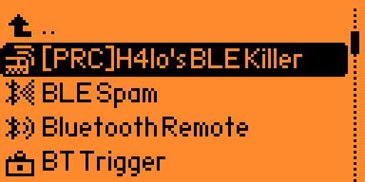
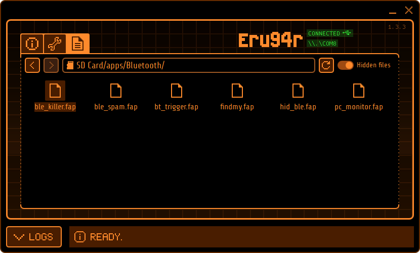
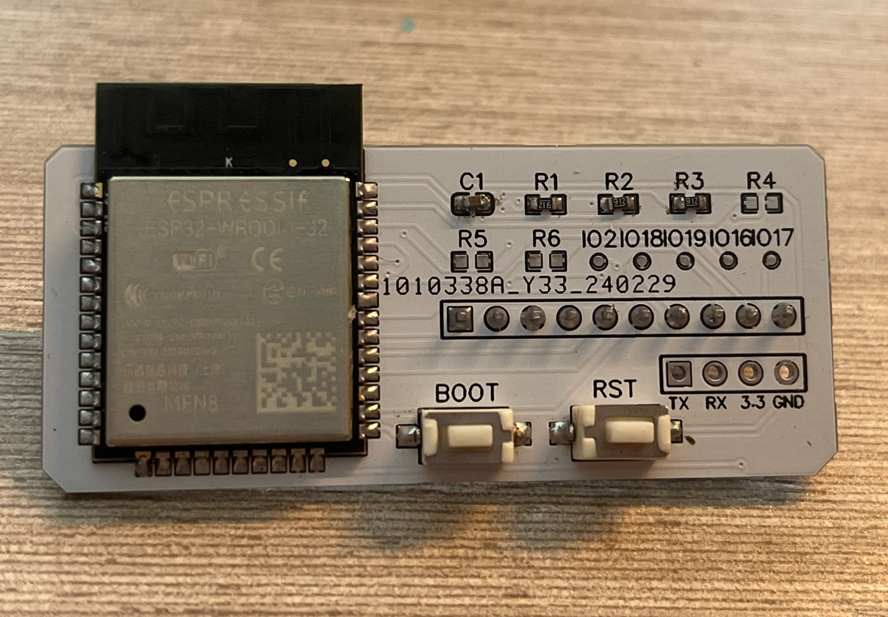

# H4lo_BLE-Killer (MNTM)蓝牙漏洞攻击程序

<h2>视频链接：</h2>

<h2>程序介绍：</h2>

该程序为国内大神[H4lo](https://github.com/H4lo)制作，程序提供了BLE 蓝牙扫描功能，以及一些蓝牙设备的漏洞攻击功能。

H4lo从事物联网安全及漏洞挖掘等相关工作，感兴趣的朋友可以去微信知识星球中搜索IoT 物联网安全(星球号90991053)，作者会不定期发布挖掘出的相关漏洞。

该程序实际的作用是提供一个BLE蓝牙漏洞攻击的框架，其主要潜在用户是从事或者对蓝牙漏洞挖掘感兴趣的朋友，当然同时也要是Flipper Zero的开发者，搞清代码以后，可以将发现的蓝牙漏洞添加到程序中来，通过修改程序及固件代码，直接进行攻击测试。

程序中本身集成的蓝牙指纹锁及平衡车控制器的攻击功能更多的作用是样例及演示。

作者原始程序只能运行在早期的Xtreme-Firmware固件下，随着Xtreme-Firmware固件的没落，目前已无法兼容新的mntm固件，跟作者沟通后，我针对mntm固件进行了兼容性修正以及汉化，目的是为了方便更多感兴趣的朋友学习研究。

修正后的中文版代码也会随程序一同发放，但无法在英文系统下使用，只能在中文固件下使用，如果要在英文固件下编译使用，可以将中文代码注释掉，将注释掉的英文代码恢复。(注意该程序只能在20240712版中文固件下运行)

相关蓝牙模块基于ESP32制作，模块原作者均已开源，大家可以去下面的地址下载制作。

<h2>程序安装位置：</h2>

<h2>模块原件清单如下：</h2>

ESP32-WROOM-32-N8 x1

1uF 603 电容 x1

10k 603 电阻 x4

0R 603 电阻 x3

TS3625X 轻触开关 x2

 2.54mm 4P排针座 X1
 
 2.54mm 排针若干

<h2>原始链接：</h2>

**原作者视频地址：**
https://www.bilibili.com/video/BV1Dw4m197BL

**原作者模块地址：**
https://oshwhub.com/h4lo/flipper-zero-ble-ext

**原作者代码地址：**
https://github.com/H4lo/flipper_zero_ble_killer

***

原作者：[H4lo](https://github.com/H4lo)

兼容性修正及汉化：宅人改造家
